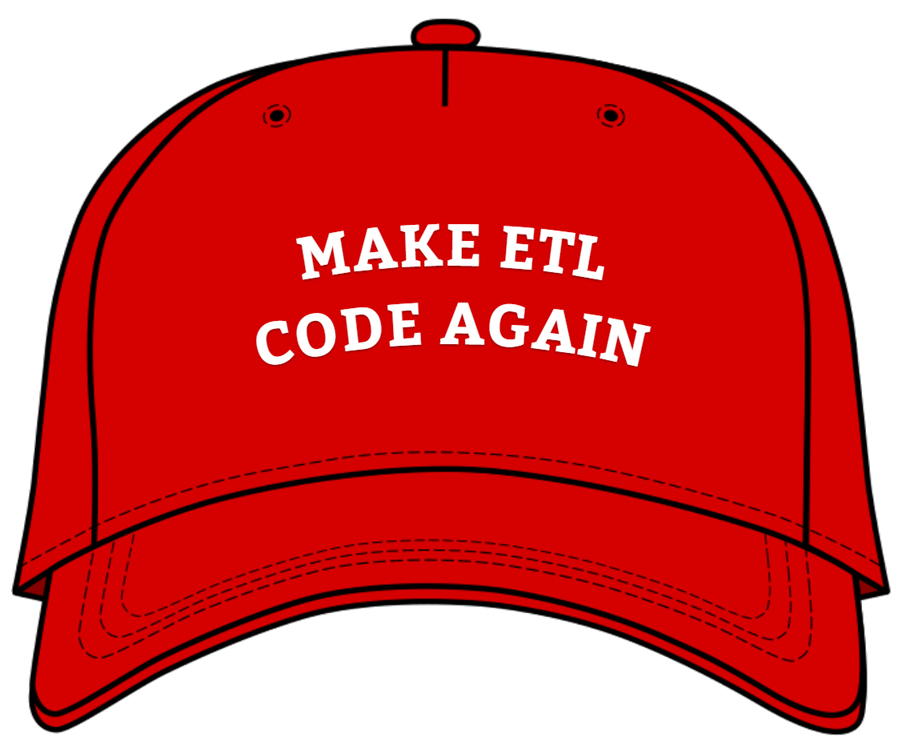

<style>
.reveal section img { background:none; border:none; box-shadow:none; }
</style>

## Client Migration with Biml

<a href="http://www.catallaxyservices.com">Kevin Feasel</a> (<a href="https://twitter.com/feaselkl">@feaselkl</a>)<br />
<a href="http://csmore.info/on/biml">http://CSmore.info/on/biml</a>

---

@title[Who Am I?]

@div[left-60]
<table>
	<tr>
		<td><a href="https://csmore.info"></a></td>
		<td><a href="https://csmore.info">Catallaxy Services</a></td>
	</tr>
	<tr>
		<td><a href="https://curatedsql.com"></a></td>
		<td><a href="https://curatedsql.com">Curated SQL</a></td>
	</tr>
	<tr>
		<td><a href="https://www.apress.com/us/book/9781484254608"></a></td>
		<td><a href="https://www.apress.com/us/book/9781484254608">PolyBase Revealed</a></td>
	</tr>
</table>
@divend

@div[right-40]
	<br /><br />
	<a href="https://www.twitter.com/feaselkl"></a>
	<br />
	<a href="https://www.twitter.com/feaselkl">@feaselkl</a>
</div>
@divend

---?image=presentation/assets/background/garden-sign.jpg&size=cover&opacity=20

### What Is Biml?

Biml is the Business Intelligence Markup Language. It is an XML-based language used to design SQL Server Analysis Services and SQL Server Integration Services solutions.

---?image=presentation/assets/background/water-rocks.jpg&size=cover&opacity=20

### Why Use Biml?

Biml offers several advantages over native Integration Services package creation:

* Biml XML is shorter and more concise.
* Biml offers templating options using .NET, letting you generalize logic and script multiple, complex SSIS packages with the help of metadata.
* Biml strips out presentation metadata, making it easier to compare in source control.

Biml is a force multiplier for ETL professionals.

---?image=presentation/assets/background/motivation.jpg&size=cover&opacity=20

### Motivation

My goals today:

* Build package(s) to migrate customer data from one database to another.
* Minimize the time I spend clicking, dragging, modifying, building, testing, and editing SSIS packages.
* Create a solution which handles table evolution over time.

---


---


---


---


---


---


---



---

@title[Understand the Problem]

## Agenda
1. **Understand the Problem**
2. Solving By Hand -- Package Walkthrough
3. Review Available Tools
4. Build Supporting Metadata
5. Write the Biml Code
6. Maintain the Biml Code

---?image=presentation/assets/background/bicycle.jpg&size=cover&opacity=20

### Understand the Problem

We have customer-specific data in the Adventure Works DW database, and we want to migrate this over to a new copy of the database.

To do this, we need to copy data from all tables which relate somehow to dbo.DimCustomer.

---


---?image=presentation/assets/background/problem.jpg&size=cover&opacity=20

### Understand the Problem

Write an SSIS package to move this data.  Considerations:

* Foreign key constraints imply precedence
* Getting only relevant data
* Handling existing data in new database
* Can we safely re-run the package?
* Will customers enter data during migration?

---

@title[Solving by Hand]

## Agenda
1. Understand the Problem
2. **Solving By Hand -- Package Walkthrough**
3. Review Available Tools
4. Build Supporting Metadata
5. Write the Biml Code
6. Maintain the Biml Code

---?image=presentation/assets/background/table-with-chalkboard.jpg&size=cover&opacity=20

### The Ideal Package

The first step in automation:  know the task.

Building a sample SSIS package, we know we will need:

---?image=presentation/assets/background/brown-package.jpg&size=cover&opacity=50


---?image=presentation/assets/background/brown-package.jpg&size=cover&opacity=50


---?image=presentation/assets/background/brown-package.jpg&size=cover&opacity=50


---?image=presentation/assets/background/brown-package.jpg&size=cover&opacity=50


---?image=presentation/assets/background/brown-package.jpg&size=cover&opacity=50


---?image=presentation/assets/background/brown-package.jpg&size=cover&opacity=50


---?image=presentation/assets/background/brown-package.jpg&size=cover&opacity=50


---?image=presentation/assets/background/brown-package.jpg&size=cover&opacity=50


---?image=presentation/assets/background/blue-package.jpg&size=cover&opacity=20

### The Ideal Package

The ideal package gives us an idea of what we need to accomplish, as well as important package optimizations we will need.

This stub package does not need to be perfect--in fact, we will make considerable changes as we go along.  But it's easier to start when you have an end in mind.

---

@title[Review Available Tools]

## Agenda
1. Understand the Problem
2. Solving By Hand -- Package Walkthrough
3. **Review Available Tools**
4. Build Supporting Metadata
5. Write the Biml Code
6. Maintain the Biml Code

---?image=presentation/assets/background/hardware.jpg&size=cover&opacity=20

### Available Tooling


Varigance, the company behind Biml, has several tools available to help with Biml development.  Get these products at <a href="https://www.varigence.com/">their company website</a>.

---?image=presentation/assets/background/welder.jpg&size=cover&opacity=20


Biml Express is a free extension for Visual Studio.  It currently supports Visual Studio versions up to 2017.

Biml Express is updated occasionally, though support for Visual Studio 2017 did not happen until the middle of 2018, so it might not immmediately work with the latest version of Visual Studio.

---


---?image=presentation/assets/background/welder-metal.jpg&size=cover&opacity=20


BimlStudio is a fully-featured IDE with much more functionality than BimlExpress.

This is a paid product which offers a lot more than BimlExpress.  It integrates well with Analysis Services, allows you to reverse engineer packages, and makes Biml development much easier.

---?image=presentation/assets/background/white-wall.jpg&size=cover&opacity=75


@color[#00416a](BimlOnline is a beta product intended to build packages without needing to install Visual Studio at all.  Its key benefit is that it can reverse engineer an Integration Services package back into Biml.)

@color[#00416a](During the beta period, this product is free.  After it leaves beta, there will be a price associated with it.)

---?image=presentation/assets/background/flexible.jpg&size=cover&opacity=20


BimlFlex allows you to build solutions using metadata and templates, without writing code.  This is also a paid product and can be quite expensive, but can help with rapid warehouse development.

---

### BI Developer Extensions


In addition to Varigence products, BI Developer Extensions (formerly BIDS Helper) has the ability to generate packages from Biml.

BI Developer Extensions is available in the Visual Studio Gallery.

---

@title[Build Supporting Metadata]

## Agenda
1. Understand the Problem
2. Solving By Hand -- Package Walkthrough
3. Review Available Tools
4. **Build Supporting Metadata**
5. Write the Biml Code
6. Maintain the Biml Code

---?image=presentation/assets/background/space.jpg&size=cover&opacity=50

### Build Supporting Metadata

We could write Biml using hard-coded table names and hand-crafted copy-paste code, but that's not very efficient at all.  Let's create a metadata table to store everything we'll need for later.

---?image=presentation/assets/background/ceiling.jpg&size=cover&opacity=20

### Metadata Requirements

* Object details (schema name, table name, etc.)
* Foreign keys to determine table load order
* Table columns and basic select operation for migration
* Join details to get from DimCustomer to our table
* Where clause to filter out our customer

---

```sql
CREATE TABLE [dbo].[MigrationStep]
(
    [MigrationStepID] [int] IDENTITY(1,1) NOT NULL,
    [SchemaName] [sysname] NOT NULL,
    [TableName] [sysname] NOT NULL,
    [Section] [int] NULL,
    [JoinCriteria] [nvarchar](2000) NULL,
    [SelectCriteria] [nvarchar](2000) NULL,
    [WhereCriteria] [nvarchar](100) NULL,
    [NeedToDelete] [bit] NOT NULL,
    [LookupColumns] [nvarchar](512) NULL,
    [LookupColumnXML] [nvarchar](1024) NULL,
    CONSTRAINT [PK_MigrationStep] PRIMARY KEY CLUSTERED 
    (
        [MigrationStepID] ASC
    )WITH (PAD_INDEX = OFF, STATISTICS_NORECOMPUTE = OFF, IGNORE_DUP_KEY = OFF, ALLOW_ROW_LOCKS = ON, ALLOW_PAGE_LOCKS = ON, FILLFACTOR = 100) ON [PRIMARY]
) ON [PRIMARY]
GO
```

@[4-5](Object details.)
@[6](Load order.)
@[8,11-12](Table columns and basic select operation.)
@[7](Join details to get from DimCustomer to our table.)
@[9](Where clause to filter out our customer.)

---?image=presentation/assets/background/dictionary.jpg&size=cover&opacity=20

### Generating Migration Data

For a small number of tables, you can easily generate migration data by hand.  This is a one-time operation.  For a larger number of tables, you might want to script it out.

---?image=presentation/assets/background/demo.jpg&size=cover&opacity=20

### Demo Time

---

@title[Write the Biml Code]

## Agenda
1. Understand the Problem
2. Solving By Hand -- Package Walkthrough
3. Review Available Tools
4. Build Supporting Metadata
5. **Write the Biml Code**
6. Maintain the Biml Code

---

### My First Biml

Biml is just XML.  It all starts with a Biml tag:

```xml
<Biml xmlns="http://schemas.varigence.com/biml.xsd">
</Biml>
```

---

```xml
<Biml xmlns="http://schemas.varigence.com/biml.xsd">
    <Projects>
        <PackageProject Name="BIMLMigration"
			ProtectionLevel="DontSaveSensitive">
            <Parameters>
                <Parameter Name="OldWarehouseServer"
					DataType="String">.
				</Parameter>
                <Parameter Name="OldWarehouseDatabase" 
					DataType="String">AdventureWorksDW2014
				</Parameter>
            </Parameters>
            <Packages>
                <Package PackageName="MigrateCustomer" />
            </Packages>
        </PackageProject>
    </Projects>
</Biml>
```

@[2-17](Create a new project.)
@[3-4](Specify the project name and protection level.)
@[5-12](Define the parameters we need. This is just a sample.)
@[13-15](Define the packages we will build out.)

---

```xml
<Packages>
	<Package Name="MigrateCustomer" ConstraintMode="Linear"
		ProtectionLevel="DontSaveSensitive">
		<Connections>
			<Connection ConnectionName="OldWarehouseNode">
				<Expressions>
					<Expression ExternalProperty="InitialCatalog">
						@[$Project::OldWarehouseDatabase]
					</Expression>
					<Expression ExternalProperty="ServerName">
						@[$Project::OldWarehouseServer]
					</Expression>
				</Expressions>
			</Connection>
		</Connections>
		<Variables>
		    <Variable DataType="Int32"
				Name="CustomerID">12195</Variable>
		</Variables>
	    <Tasks>
	        <!-- Fill out details -->
	    </Tasks>
    </Package>
</Packages>
```

@[2](Create a new package called MigrateCustomer.dtsx.)
@[4-15](Create a new connection.)
@[6-13](Use the project parameter to override default values.)
@[16-19](Define any variables we will need.)
@[20-22](Build out the control flow for each package.)

---?image=presentation/assets/background/connections.jpg&size=cover&opacity=20

### Connections

We can define connections in a separate file to make them easier to find.  Biml lets you combine files together after the fact.

```xml
<Biml xmlns="http://schemas.varigence.com/biml.xsd">
    <Connections>
        <!-- Connections we will use in our packages -->
        <Connection Name="OldWarehouseNode" ConnectionString="Data Source=LOCALHOST;Initial Catalog=AdventureWorksDW2014;Provider=SQLNCLI11.1;Integrated Security=SSPI;Auto Translate=False;" />
        <Connection Name="NewWarehouseNode" ConnectionString="Data Source=LOCALHOST;Initial Catalog=AdventureWorksDW2014Dest;Provider=SQLNCLI11.1;Integrated Security=SSPI;Auto Translate=False;" />
        <!-- Connection we will use to retrieve information to build our packages -->
        <Connection Name="MetadataConnectionString" ConnectionString="Provider=SQLNCLI11;Server=LOCALHOST;Initial Catalog=AdventureWorksDW2014;Integrated Security=SSPI;" />
    </Connections>
</Biml>
<#@ template tier="1" #>
```

@[2-8](Connections we will use.)
@[4-5](Connecting to the old and new warehouses.)
@[7](Connecting to our metadata repository.)
@[10](Templating lets us order our files.)

---?image=presentation/assets/background/levels.jpg&size=cover&opacity=20

### Templates

Templates let us group together files into "tiers."  The Biml engine processes tiers in ascending order, so files with `tier="1"` run before `tier="2"` and so on.  You do not need to number your tiers sequentially--you might want to leave gaps for future growth.

In our code, connections is tier 1 and the project/package file is tier 2.

---

### Fleshing Out Our Tasks

A simplified form of the package:

```xml
<Package Name="MigrateCustomer" ConstraintMode="Linear"
	ProtectionLevel="DontSaveSensitive">
    <Tasks>
        <#*=CallBimlScript("cbs-DeleteAndLoad.biml") *#>
        <#=CallBimlScript("cbs-LookupLoad.biml") #>
    </Tasks>
</Package>
```

@[4](In Biml, the asterisk comments out calls.)
@[5](Call a separate Biml file.)

---?image=presentation/assets/background/telephones.jpg&size=cover&opacity=20

### CallBimlScript

The CallBimlScript function lets us reference a separate Biml file.  Here, we use it to decide between a delete-and-reload strategy and an incremental load approach.  In other places, you can use CallBimlScript to abstract out common functionality.

Let's take a look at the code.

---?image=presentation/assets/background/demo.jpg&size=cover&opacity=20

### Demo Time

---

@title[Maintain the Biml Code]

## Agenda
1. Understand the Problem
2. Solving By Hand -- Package Walkthrough
3. Review Available Tools
4. Build Supporting Metadata
5. Write the Biml Code
6. **Maintain the Biml Code**

---?image=presentation/assets/background/engineering.jpg&size=cover&opacity=20

### Metadata Maintenance

As tables change, we should keep the metadata we created up to date.

To support table changes, we just need to re-generate the packages from the Biml script we created.  No additional changes are necessary.

---?image=presentation/assets/background/blue-package.jpg&size=cover&opacity=20

### Package Changes

If we want to change the package(s) we create, we can modify the Biml directly.

As the Biml scripts change, we just need to re-generate packages from the scripts.  If you built your Biml correctly, you should not need to modify your packages directly.

Treat the packages as binaries and Biml as source code.

---?image=presentation/assets/background/newspapers.jpg&size=cover&opacity=20

### Source Control

You should store your Biml in source control.  With the Biml in source control and a Biml-first approach with no post hoc SSIS package changes, packages do not necessarily need to be checked in.

An advantage to Biml over raw SSIS packages is that you can perform meaningful diffs against Biml scripts, something you cannot do with SSIS packages.

---?image=presentation/assets/background/wrappingup.jpg&size=cover&opacity=20

### Wrapping Up

Biml is a powerful language.  We've seen one use case in which Biml saved dozens of hours of development and maintenance time.

With small tweaks, I've implemented this several times in different guises.

---

### For More

To learn more, go here:  <a href="http://csmore.info/on/biml">http://CSmore.info/on/biml</a>

And for help, contact me:  <a href="mailto:feasel@catallaxyservices.com">feasel@catallaxyservices.com</a> | <a href="https://www.twitter.com/feaselkl">@feaselkl</a>
